<h1>Installing and using MITRE ATT&CK Navigator</h1>

<h2>Description</h2>
MITRE ATT&CK® Navigator is an interactive visualization tool for viewing ATT&CK matrices and mapping detections, coverage, gaps, and adversary techniques. Security operations and blue teams use it to assess which ATT&CK techniques their environment can detect and where improvements are needed.
<br />

<h2>Environments Used </h2>

- <b>Ubuntu</b>
- <b>VMWare</b>

<h2>Walk-through:</h2>

<p align="center">
<h2>1. Installing the Navigator </h2>
<br/>
<b>Update packages and install Docker and Docker Compose: </b>
<br />
<br />
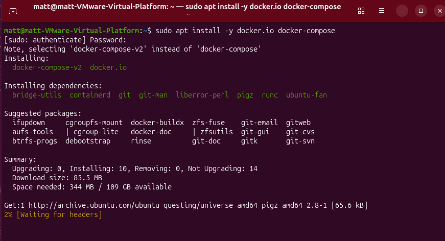
<b>Add your user to the docker group and apply the change:
sudo usermod -aG docker $USER 
newgrp docker
</b>
<br />
<br />
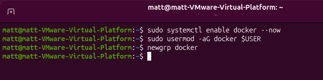
<b>Verify installation:
docker –version
</b>
<br />
<br />
<b>Clone the Navigator repository. git clone https://github.com/mitre-attack/attack-navigator.git 
cd attack-navigator
</b>
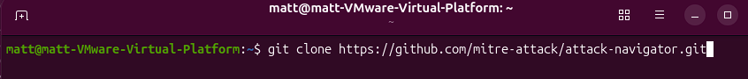
<br />
<br />
<b>
Build the Docker image.
From the repository root:
docker build -t attack-navigator .
</b>
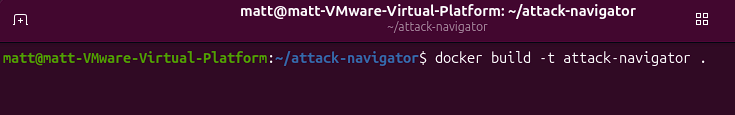
<br />
<br />
<b>This builds the Angular application inside the container, keeping your host environment clean. Build time typically takes 5–10 minutes or longer depending on your system.
</b>
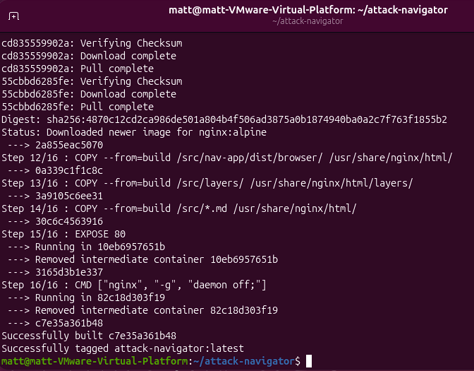
<br />
<br />
<b>After installation, Run the container with docker run -d \   --name attack-navigator \
  -p 4200:4200 \
  attack-navigator
</b>
<br />
<br />
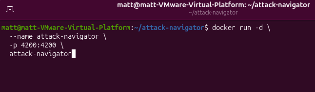
<b>Open the UI in a browser at: http://:4200
Navigator is now live.
</b>
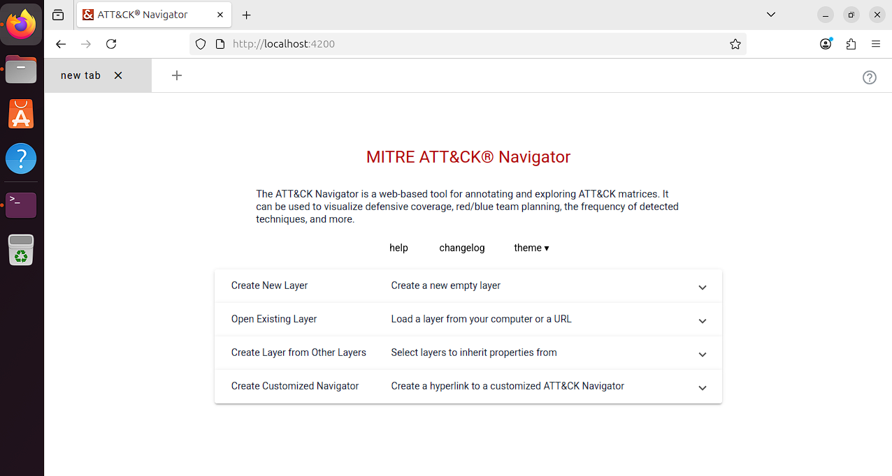
<br />
<br />
<b>If this doesn’t work, you can install the angular cli and serve the navigator with npm</b>
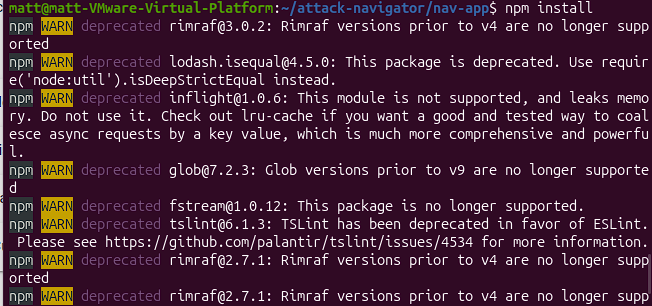
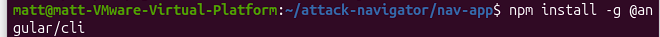
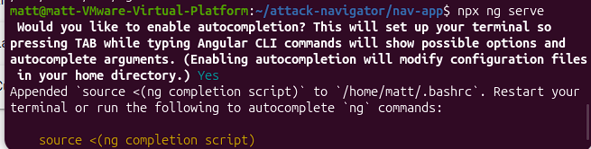
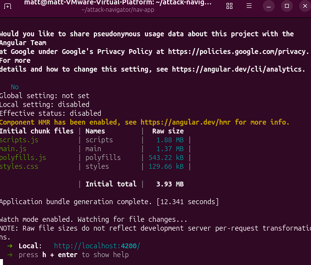
<br />
<br />
  
<h2>2. Persistent Config and New Layers</h2>
<br/>
<b>Creating a new layer opens the MITRE ATT&CK® Navigator matrix view, an interactive visualization that maps attacker behaviors and lets you highlight techniques relevant to your environment (detections, threats, gaps, or coverage).
</b>
<br />
<br />

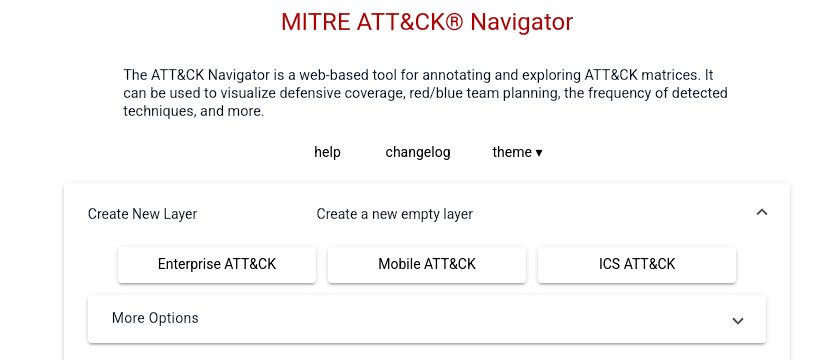
<b>To use custom layers, banners, TAXII settings, or keep data offline, mount host volumes into the container.
Remove the existing container
sudo docker stop attack-navigator
sudo docker rm attack-navigator
</b>
<br />
<br />
<b>Re-run the container with a mounted assets volume
docker run -d \   --name attack-navigator \
  -p 4200:4200 \
  -v $(pwd)/nav-app/src/assets:/app/nav-app/src/assets \
  attack-navigator
</b>
<br />
<br />
<b>Open the UI in your browser: http://:4200
</b>

<br />
<br />
<b>Load a sample layer (paste into the Navigator “Open Existing Layer → Load from URL”): https://raw.githubusercontent.com/mitre-attack/attack-navigator/master/layers/samples/Bear\_APT.json
</b>
<br />
<br />
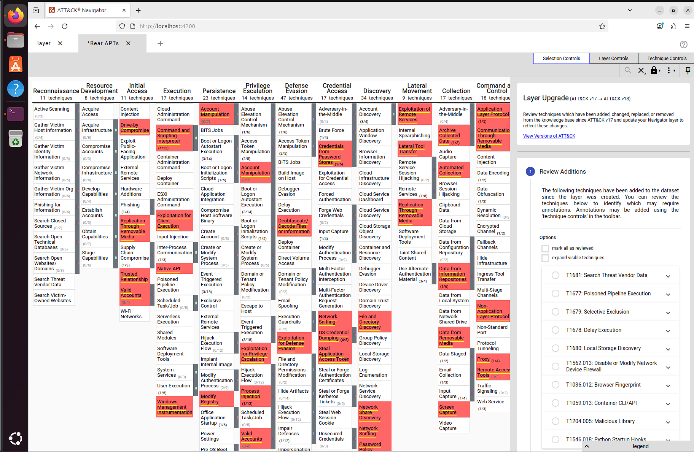
<b>
You will see techniques highlighted for a real adversary set. Layers can be downloaded as portable .json files.
</b>
<br />
<br />
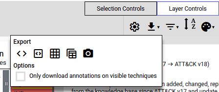
<b>To add a local layer (replace my-layer.json with your filename):
cp my-layer.json nav-app/src/assets/
</b>
<br />
<br />
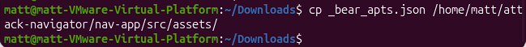
<b>Then in the UI: Open Existing Layer → Upload from Local.
</b>
<br />
<br />


</p>

<!--
 ```diff
- text in red
+ text in green
! text in orange
# text in gray
@@ text in purple (and bold)@@
```
--!>
